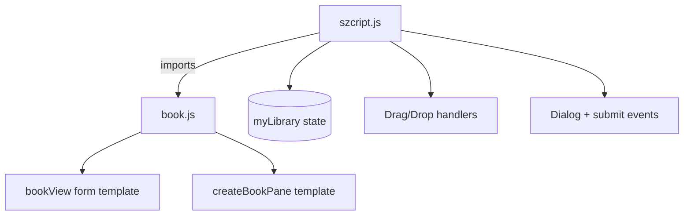

# Bookly - Personal Library Tracker

A lightweight Kanban-style library app built with vanilla JavaScript, HTML, and CSS.  
Users can add books through a modal form, attach a cover image, and organize titles across reading stages using drag and drop.

**Live Demo:** [smailoujaoura.github.io/odin_library](https://smailoujaoura.github.io/odin_library/)

---

## Preview

<video src="docs/Kooha-2026-04-07-20-43-59.webm" controls muted playsinline width="100%"></video>

> If your Markdown viewer does not render `.webm`, open the file directly from `docs/`.

---

## Why This Project Matters

This project demonstrates front-end fundamentals that recruiters care about:

- Building interactive UI without frameworks
- Managing in-memory application state
- Handling user-generated content (file inputs)
- Implementing drag-and-drop user workflows
- Structuring reusable UI generation with modular JavaScript

It is also a good example of translating a product idea ("track what I want to read") into a working, user-centered interface.

---

## Features

- Add new books from a modal dialog (`title`, `author`, `pages`, optional `cover`)
- Display books as draggable cards
- Organize books into three statuses:
  - `TO READ`
  - `READING`
  - `READ`
- Drag and drop between columns for quick status updates
- Clean dark-themed UI with custom CSS variables

---

## Tech Stack

- **HTML5** for semantic structure
- **CSS3** for layout, theming, and modal/card styling
- **Vanilla JavaScript (ES Modules)** for state + interactivity
- **Browser APIs**:
  - `crypto.randomUUID()` for unique IDs
  - `HTMLDialogElement` for modal behavior
  - Drag and Drop events (`dragstart`, `dragover`, `drop`)
  - `URL.createObjectURL()` for local image previews

---

## Architecture (High Level)

```mermaid
flowchart LR
    A[User Clicks Add New] --> B[Open Dialog Form]
    B --> C[Submit Book Data]
    C --> D[Create Book Object + UUID]
    D --> E[Push into myLibrary Array]
    E --> F[Generate Book Card Markup]
    F --> G[Render in TO READ Column]
    G --> H[User Drags Card]
    H --> I[Drop in Target Column]
    I --> J[DOM Position Updates]
```



### Module boundaries



---

## Data Model

Each book is modeled with a constructor function:

```js
Book(uuid, name = "None", author = "None", status = "None", pages = 0)
```

Core properties:

- `uuid`: unique identifier
- `name`: title
- `author`: author name
- `status`: current reading status
- `pages`: page count

---

## Key Learning Outcomes

### 1) Event-driven UI architecture
- Connected multiple event layers: button click, dialog close, form submit, drag/drop.
- Practiced separating UI templates from behavior logic through module imports.

### 2) Working with browser APIs
- Used `crypto.randomUUID()` for reliable identity generation.
- Used `URL.createObjectURL()` to display local cover uploads without a backend.
- Used native `<dialog>` instead of third-party UI libraries.

### 3) State and DOM synchronization
- Learned the tradeoff between a simple in-memory array and the rendered DOM state.
- Identified where true state updates should happen (especially when status changes via drag/drop).

### 4) Visual information design
- Applied color-based status segmentation and card-based layout for fast scanning.
- Built a usable UI with plain CSS and no component framework.

---

## Difficulties Faced (and How They Were Handled)

- **Drag-and-drop reliability:** ensuring the correct draggable parent card was selected and moved.
- **Modal UX details:** handling open/close lifecycle and submit flow cleanly.
- **File input + cover preview concerns:** managing optional files and object URL usage.
- **Layout balancing:** preserving readability across three columns with flexible width behavior.
- **State consistency risks:** recognizing that visual movement alone is not the same as updating persistent status.

---

## Optimization Opportunities

These are practical improvements that would raise engineering quality further:

- **Persist data** using `localStorage` (or backend API) so library content survives refresh.
- **Update status in state on drop** so business data always matches UI placement.
- **Refactor from constructor function to class/factory** for clearer extensibility.
- **Use event delegation** to reduce per-card event listener attachment overhead.
- **Revoke object URLs** (`URL.revokeObjectURL`) when no longer needed to avoid leaks.
- **Accessibility pass**:
  - Add keyboard-friendly interactions for drag/drop alternatives.
  - Improve dialog focus management and ARIA labels.
- **Validation hardening** for page count and required field edge cases.

---

## Academic and Portfolio Value

From an academic perspective, this project demonstrates competency in:

- DOM manipulation and dynamic rendering
- Event propagation and browser interaction models
- Modular JavaScript design
- Human-computer interaction basics (workflow clarity + visual hierarchy)

From a portfolio perspective, it communicates:

- Ability to build complete features end-to-end
- Strong fundamentals without over-reliance on frameworks
- Awareness of tradeoffs, limitations, and improvement roadmap
- Product thinking: turning a real workflow into usable software

---

## Future Roadmap

- Add edit/delete actions on cards
- Add filters and search by title/author/status
- Track reading progress percentage
- Add sorting (title, pages, recently added)
- Migrate to TypeScript for stronger type safety
- Add test coverage for core flows

---

## Run Locally

1. Clone the repository
2. Open `index.html` in your browser  
   or
3. Serve with a simple static server:

```bash
python -m http.server 8080
```

Then open `http://localhost:8080`.

---

## Project Reflection

Bookly started as a small CRUD-like UI task, but it became a strong exercise in front-end engineering discipline: decomposing UI concerns, wiring multi-step interactions, and thinking beyond "it works" toward maintainability, accessibility, and data integrity.  
That mindset shift - from building features to designing robust systems - is the most valuable takeaway from this project.

